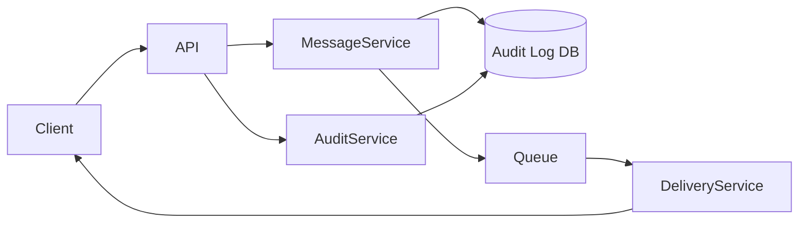
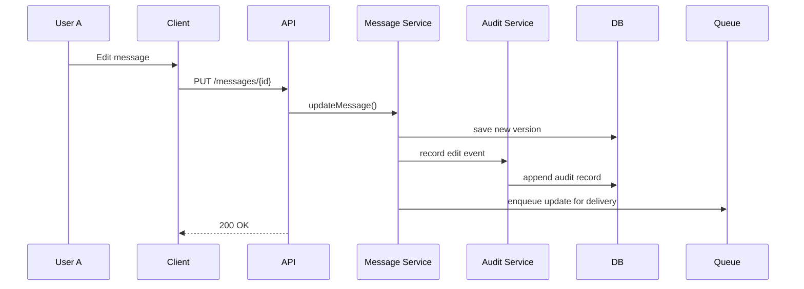
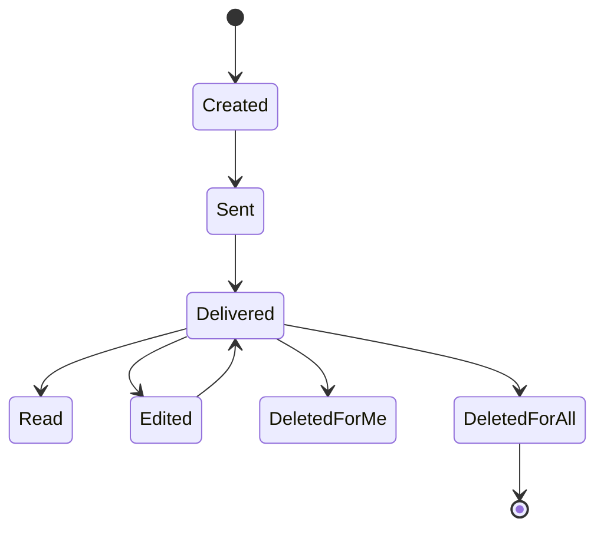

# Lab 1 : Variant 6

## Functional Requirements

1. A user can send messages to another user.
2. Each message has a lifecycle (sent / delivered / read).
3. Messages can be:
  * edited after being sent;
  * deleted for the sender only;
  * deleted for all participants.
4. The system must:
  * store messages and their versions,
  * deliver updates asynchronously,
  * keep an audit trail of edits and deletions.
5. Recipients may be online or offline.
6. The system must ensure consistency across all clients.

## Part 1 - Component Diagram 

A **component diagram** that shows the following will be created:
* system components,
* their responsibilities,
* interactions between them.

### Required components
* Client (Web / Mobile)
* Backend API
* Message Service
* Audit Log Service
* Database
* Delivery mechanism (Queue / WebSocket / Push)



### Component responsibilities
* **Client** - displays messages and updates (edit/delete events)
* **Backend API** - entry point for user actions (send/edit/delete)
* **Message Service** - manages message state and versions
* **Audit Service** - stores immutable history of changes
* **Database** - persists messages and audit records
* **Queue & Delivery Service** - asynchronously delivers updates to recipients

## Part 2 - Sequence Diagram 
### Scenario
User A edits a message that was already delivered to offline user B.



### Explanation
* The message content is updated. 
* A new version is stored.
* The audit log records who edited the message and when.
* The update is queued for delivery to offline user B.

## Part 3 - State Diagram
### Object: Message



### Notes
* DeletedForMe means the message is hidden only for one user.
* DeletedForAll means the message is removed (or replaced with a tombstone) for all participants.
* Edited messages remain in the system, but previous versions are preserved in the audit log.

## Part 4 - RFC (Request for Comments)
```markdown
## RFC: Message Editing & Deletion Strategy

### Context
Users can edit or delete messages after they are sent. Other users may be online or offline.

### Problem
The system must ensure consistency between users while preserving an audit trail of changes for moderation, compliance, and debugging.

### Proposed Solution
Messages are treated as logically mutable but physically immutable:
- Each edit creates a new message version.
- Deletions are represented as tombstone events.
- An audit log stores all edits and deletions.
- Updates are delivered asynchronously to all participants.

### Alternatives
- Hard delete messages from the database (rejected due to loss of auditability)
- Allow edits only within a short time window (considered, but rejected for flexibility)

### Consequences
+ Strong consistency between clients  
+ Full audit trail for moderation  
- Increased storage usage  
- More complex synchronization logic
```

## Part 5 - ADR (Architecture Decision Record)
```markdown
## ADR-002: Immutable Message History with Audit Log

### Status
Accepted

### Decision
Messages will be stored as versioned entities. Each edit or delete action produces a new event recorded in an audit log.

### Consequences
- Full traceability of user actions
- Support for moderation and abuse investigation
- Higher storage requirements
- More complex message retrieval logic on the client
```

## Design Rationale (Key Questions)

### Mutable vs Immutable Messages
* **Decision:** Messages are logically mutable but physically immutable.
* **Explanation:** The user sees the message as "edited". Internally, the system stores:
  * original version,
  * edited versions,
  * deletion events.
* This ensures:
  * auditability,
  * rollback capability,
  * legal and moderation compliance.

### Audit Trail Design

Each message change produces an event:

|   Event Type   |              Stored Data              |
|----------------|---------------------------------------|
| MessageSent    | senderId, content, timestamp          |
| MessageEdited  | messageId, editorId, newContent, time |
| MessageDeleted | messageId, actorId, scope (me/all)    |

### Audit records are:
* append-only,
* immutable,
* not visible to regular users.